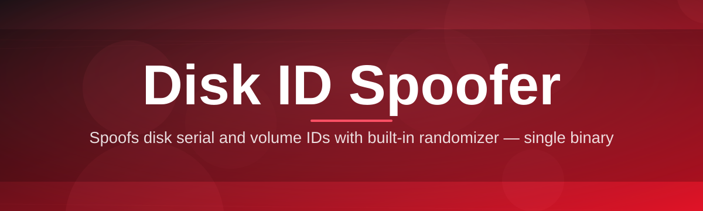

# disk-id-editor 💽🎭

  

*Give your drive a new identity in seconds — no dark arts required, just clean, controlled disk metadata editing.*

  

## 🔍 Overview

Every physical and virtual disk on a Windows machine carries a quiet fingerprint — a **Volume Serial Number**, and in many cases deeper hardware identifiers baked into the disk descriptor. Software licensing systems, hardware-locked tools, virtual machine detectors, and even some game launchers quietly read that fingerprint to decide whether your machine looks "familiar." **disk-id-editor** exists because that fingerprint shouldn't be a black box you're powerless against — it's your disk, on your machine, and you deserve a transparent way to view, understand, and rewrite it.

This project started as a small internal utility for testers who needed a clean, repeatable way to reset disk identity between test runs without reimaging entire virtual machines. It grew into a full **disk ID spoofer** with a proper interface, safety rails, and a workflow that respects how disks actually behave under Windows' storage stack. Whether you're a QA engineer validating licensing edge cases, a systems researcher studying hardware fingerprinting, or a privacy-conscious user who wants a fresh disk signature on a rebuilt machine, this tool was shaped around your workflow.

We built disk-id-editor to be the kind of tool you forget is "just a script" — it feels like a proper desktop application, with a modern UI, sane defaults, and enough guardrails that you can't accidentally brick a production drive without at least three confirmations. No bloat, no background services, no telemetry phoning home. Just a focused Windows utility that does one job — disk identifier spoofing — and does it precisely.

---

## ⚡ What Makes It Tick

**Live Disk Fingerprint Preview** — the moment you launch the app, it scans attached drives and shows you their current Volume Serial Numbers and disk signatures in a clean, sortable list — no digging through `diskpart` or the registry.

**One-Click Serial Rewrite** — pick a drive, generate or type a new serial, hit apply. The engine handles the low-level write path so you don't have to touch raw disk sectors yourself.

**Randomized Identity Generator** — need a fresh, plausible-looking serial instantly? The built-in generator produces properly formatted values that pass standard validation checks used by most licensing and detection routines.

**Snapshot & Restore** — before any change is committed, disk-id-editor takes a lightweight snapshot of the original identifiers, so reverting to factory state is a single click away.

**Multi-Drive Batch Mode** — spoof identifiers across several attached disks or VM virtual disks in one pass, ideal for lab environments and repeatable test rigs.

**Dry-Run Simulation** — preview exactly what would change, byte-for-byte, without writing anything, so you can validate a plan before committing to it.

**Portable, Zero-Install Footprint** — a single executable, no installer wizard, no registry sprawl left behind, and nothing to uninstall beyond deleting the file.

**Dark & Light Interface Themes** — because disk tooling doesn't have to look like it escaped from 2004.

> [!TIP]
> Run a **Dry-Run Simulation** the first time you touch any new drive type — it costs nothing and shows you exactly what the write operation will target.

---

## 🚀 Getting Rolling

1. **Visit the landing page** using the download button above — that's the only official source for builds.

2. **Download the latest build** — it arrives as a single portable executable, no bundled installer.

3. **Run it as Administrator** — disk identifier writes require elevated privileges on Windows, the app will prompt you if it isn't elevated.

4. **Select a drive, preview, then apply** — always check the live preview panel before committing a change.

> [!NOTE]
> The first launch may take a few extra seconds while Windows' SmartScreen reputation check catches up with a newly published build. This is normal for small, fast-moving open-source tools.

---

## 🖥️ System Requirements

| Requirement | Details |
|---|---|
| OS | Windows 10 (64-bit) or Windows 11 |
| Privileges | Administrator (required for raw disk access) |
| Dependencies | None — fully self-contained executable |
| Disk Space | Under 15 MB |
| .NET Runtime | Bundled, nothing to install separately |
| Architecture | x64 |

  

---

## 🛠️ How It Works

Under the hood, disk-id-editor talks to Windows' storage APIs directly rather than shelling out to third-party drivers. The flow is intentionally linear and auditable:

1. **Enumerate** — the app queries attached physical and logical disks through the Windows Disk Management interfaces.
2. **Snapshot** — current identifiers are read and cached locally in memory before anything is touched.
3. **Stage** — you choose a new serial (manual or generated) and the app validates its format.
4. **Commit** — the write operation targets only the specific identifier field, using a low-level IOCTL call scoped to that disk.
5. **Verify** — the app re-reads the disk immediately after writing to confirm the new fingerprint stuck.

> [!IMPORTANT]
> The commit step only ever touches the identifier field it's told to change. It does not reformat, repartition, or touch file system data — but as with any low-level disk operation, back up anything irreplaceable first.

---

## 🧩 Troubleshooting Corner

<strong>The app says "Access Denied" when I try to apply a change</strong>

You're almost certainly not running as Administrator. Right-click the executable and choose "Run as administrator" — Windows blocks raw disk identifier writes for standard user accounts by design.

<strong>My new serial number reverted after a reboot</strong>

Some virtual disk formats (particularly certain VHD/VHDX configurations) regenerate identifiers on mount. Try applying the change again after the VM has been powered on at least once, or check the Snapshot log to confirm the write actually persisted.

<strong>A licensing tool still detects the old identifier</strong>

Many detection systems cache fingerprints locally or check multiple identifier sources (volume serial, disk signature, SMART data) simultaneously. disk-id-editor targets the volume and disk-level identifiers — it isn't a universal answer to every detection method out there.

<strong>SmartScreen or my antivirus flagged the download</strong>

Low-level disk utilities frequently trigger heuristic flags simply because they touch raw storage APIs — this is a common false-positive category for tools in this space. Only download from the official landing page linked in this README.

<strong>Batch mode skipped one of my drives</strong>

Removable media and some USB enclosures report read-only flags to Windows at the firmware level. Check the drive's write-protection status before retrying.

> [!WARNING]
> Never apply identifier changes to a disk currently hosting your active operating system boot partition unless you fully understand the consequences — some boot loaders reference disk signatures during startup.

---

## 🎨 Interface, Shortcuts & Settings

- **Ctrl + R** — refresh the drive list
- **Ctrl + G** — generate a randomized serial for the selected drive
- **Ctrl + Z** — restore the last snapshot for the selected drive
- **Ctrl + D** — toggle Dry-Run mode on/off
- **F2** — rename a saved profile
- **Theme toggle** — switch between Dark and Light in the settings gear icon, top-right
- **Settings panel** — configure default snapshot location, confirmation prompt sensitivity, and startup drive scan behavior

> [!TIP]
> Save frequently-used serial patterns as named profiles from the Settings panel — handy for QA teams that need consistent, repeatable disk fingerprints across test cycles.

---

## 🤝 Contributing & Community

We welcome pull requests, issue reports, and feature ideas — this tool grows because people using it in the field keep pushing it further.

* Found a bug? Open an issue with your Windows build number and drive type.
* Have an idea for a new identifier field to support? Start a discussion thread first so we can scope it together.
* Want to add a UI theme or localization? PRs are very welcome, small and focused is best.

> [!NOTE]
> Please avoid submitting pull requests that add network calls or telemetry — keeping this tool fully offline and self-contained is a core project value.

---

## 📜 License

Released under the [MIT License](LICENSE), 2026. Use it, fork it, build on it — just carry the license forward.

---

## ⚠️ Disclaimer

disk-id-editor is provided for legitimate systems administration, software testing, quality assurance, and research purposes. It modifies low-level disk identifier metadata on drives you own or are authorized to manage. You are solely responsible for how you use this tool and for complying with any applicable software licenses, terms of service, or local regulations. The maintainers provide no warranty and accept no liability for data loss, licensing disputes, or unintended consequences arising from its use — always back up important data before performing disk-level operations.

